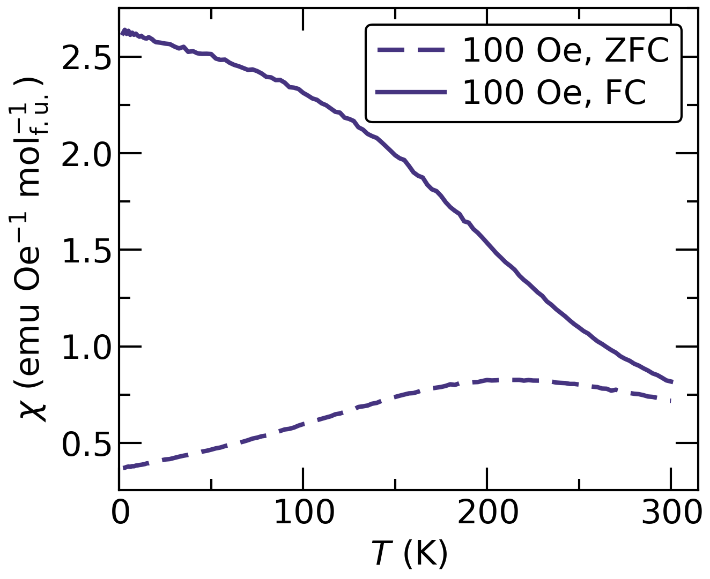
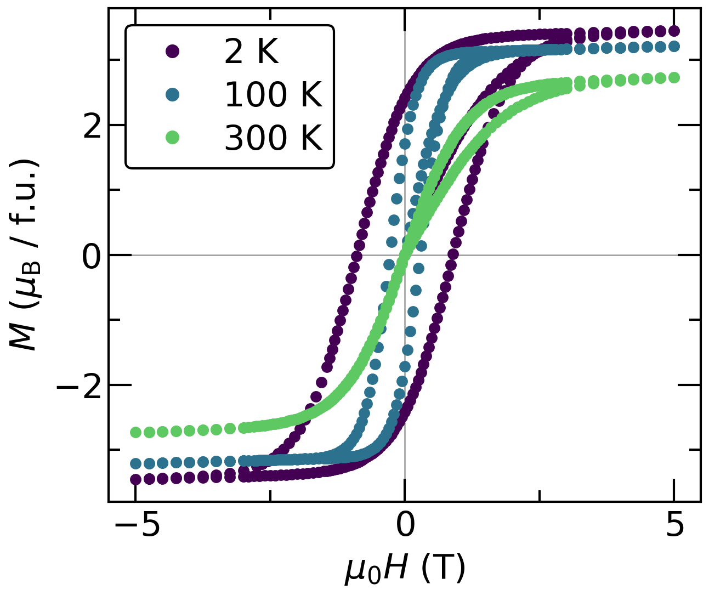

# plot_mpms.py

Turn Quantum Design MPMS3 `.dat` files into publication-ready magnetometry plots.




`plot_mpms.py` reads your MPMS3 data and can produce:

* **χ(T)** plots with ZFC and FC data distinguished
* **χ⁻¹(T)** plots with optional Curie–Weiss fits
* **M(H)** hysteresis loops at every measured temperature
* data normalised **per sample, per gram, per mole of formula units, per mole of magnetic ion, or in µB**

You don't need to prepare the data first. Point the script at a folder containing your `.dat` files, choose which files to plot, and it will ask you for anything else it needs.

The script gets the sample mass from the MPMS file header and asks you for the chemical formula once. From that, it calculates the molar mass and the requested normalisations.

## Quick start

### 1. Install the requirements

You need **Python 3.9 or newer** and four Python packages:

```bash
py -m pip install numpy pandas matplotlib scipy
```

On macOS or Linux, use `python3` instead of `py`.

### 2. Put your MPMS files in a folder

The script works directly with the `.dat` files produced by MultiVu. You don't need to modify them.

For the script to recognise a file, its name must contain either:

* `_MvT_` for a temperature-dependent measurement
* `_MvH_` for a field-dependent measurement

For example:

```text
NaRhO2_MattW_23p35mg_MvT_500Oe_ZFC.dat
NaRhO2_MattW_23p35mg_MvT_500Oe_FC.dat
NaRhO2_MattW_23p35mg_MvH_2K.dat
NaRhO2_MattW_23p35mg_MvH_100K.dat
```

### 3. Run the script

If the script is in your current folder:

```bash
py plot_mpms.py "C:\MPMS\NaRhO2 run 3"
```

Or, if you are already in the folder containing the data:

```bash
py C:\Users\you\Code\plot-mpms\plot_mpms.py
```

The script will show you the files it found and let you select which ones to plot:

```text
[  1] NaRhO2_MattW_23p35mg_MvT_500Oe_FC.dat
[  2] NaRhO2_MattW_23p35mg_MvT_500Oe_ZFC.dat
[  3] NaRhO2_MattW_23p35mg_MvH_2K.dat
[  4] NaRhO2_MattW_23p35mg_MvH_100K.dat

Select files: e.g. '1,3-5,8' | 'all' | 'mvt' | 'mvh' | 'q' to quit
>
```

You can select individual files, ranges, or everything:

```text
1,3,4
1-4
all
mvt
mvh
```

The script then asks for the information needed to normalise the data. Once you've entered a formula for a sample, it is remembered for future runs.

That's it. The resulting PNG files are written alongside your data unless you specify a different output directory.

---

## What does the script actually calculate?

For **MvT** measurements, the script calculates magnetic susceptibility:

**χ = M / H**

and can plot both χ(T) and χ⁻¹(T).

For **MvH** measurements, it plots magnetisation against magnetic field and can display the data in several normalisations, including µB per formula unit or per magnetic ion.

The available normalisations are:

| Normalisation | χ(T)                | M(H)           |
| ------------- | ------------------- | -------------- |
| `emu`         | emu Oe⁻¹            | emu            |
| `g`           | emu Oe⁻¹ g⁻¹        | emu g⁻¹        |
| `fu`          | emu Oe⁻¹ mol f.u.⁻¹ | emu mol f.u.⁻¹ |
| `ion`         | emu Oe⁻¹ mol ion⁻¹  | emu mol ion⁻¹  |
| `mub_fu`      | —                   | µB per f.u.    |
| `mub_ion`     | —                   | µB per ion     |

By default, MvT data are normalised per formula unit and MvH data are plotted in µB per formula unit.

---

## File naming

The filename tells the script what kind of measurement it is and provides some useful metadata.

The basic patterns are:

```text
<sample-id>_<mass>mg_MvT_<field>Oe_<FC|ZFC>.dat
<sample-id>_<mass>mg_MvH_<temperature>K.dat
```

The important parts are:

| Part             | Example              | Meaning                                       |
| ---------------- | -------------------- | --------------------------------------------- |
| Measurement type | `_MvT_`, `_MvH_`     | Required; also marks the end of the sample ID |
| Mass             | `23p35mg`, `23.35mg` | Sample mass                                   |
| Field            | `500Oe`, `0p5T`      | MvT measuring field                           |
| Temperature      | `2K`, `1p8K`         | MvH measurement temperature                   |
| Branch           | `ZFC`, `FC`          | MvT branch                                    |

A `p` can be used instead of a decimal point, so `23p35mg` means 23.35 mg.

The filename mass is only a cross-check. The script uses `SAMPLE_MASS` from the MPMS file header as the authoritative value. If the filename and header differ by more than 0.005 mg, the script warns you.

Files without `_MvT_` or `_MvH_` are skipped.

---

## Formula and magnetic-ion input

For molar and µB normalisations, the script needs the chemical formula.

For example:

```text
Formula unit: Na0.5RhO2
Magnetic ion: Rh
```

The formula parser supports:

* integer subscripts: `NaRhO2`
* decimal subscripts: `Na0.5RhO2`
* parentheses: `(Na0.5K0.5)RhO2`
* nested compositions: `Ba(FeO2)2`

Element symbols are case-sensitive. Use `Rh`, not `RH` or `rh`.

The formula must describe the **resolved composition**. For example, `Na1-xRhO2` cannot be parsed; if `x = 0.5`, enter:

```text
Na0.5RhO2
```

The script calculates the molar mass from the formula and uses the stoichiometric coefficient of the magnetic ion for per-ion normalisation.

---

## Curie–Weiss fitting

Use `--fit` to fit the high-temperature MvT data.

The script supports three analyses:

1. **Modified Curie–Weiss**

   χ = χ₀ + C/(T − θ)

2. **Plain Curie–Weiss**

   χ = C/(T − θ)

3. **Linear fit to 1/χ**

The default is the modified Curie–Weiss fit using nonlinear least squares.

For example:

```bash
py plot_mpms.py . --fit --fit-range 150 300
```

You can also choose which branch is fitted:

```bash
--fit-which zfc
--fit-which fc
--fit-which both
```

The script always calculates all three fit types and saves their results in the fit report. The selected model is the one shown on the figure.

### Choosing the fit range

Choose a temperature range that is clearly above the magnetic ordering transition.

A fit that extends into the transition region can produce a value of θ that reflects the transition itself rather than the underlying paramagnetic correlations.

A useful practical check is to look at χ⁻¹(T): choose a range where it is approximately linear.

The fit report records the source file, moment column, sample mass, molar mass, fit range, fit parameters, and residual statistics so that the reported numbers can be traced back to the original data.

---

## Diamagnetic correction

Use:

```bash
--diamagnetic
```

to subtract an estimate of the diamagnetic contribution calculated from Pascal's constants.

Alternatively, provide your own value:

```bash
--chi-dia VALUE
```

where the value is in emu/mol f.u.

The correction is applied to χ(T) and the Curie–Weiss fit, but **not** to M(H).

The Pascal's-constants value is only an estimate. If the correction is important for your material, it is better to use a value from an appropriate reference or your own measurement.

---

## What files are produced?

Figures are saved as PNG files at the requested DPI (300 by default).

Typical outputs include:

| File                                   | Contents                                                            |
| -------------------------------------- | ------------------------------------------------------------------- |
| `<sample>_MvT_<field>_<tag>_XvT.png`   | χ vs. temperature                                                   |
| `<sample>_MvT_<field>_<tag>_X-1vT.png` | χ⁻¹ vs. temperature, including the fit if requested                 |
| `<sample>_MvT_all-fields_<tag>_*.png`  | Multiple fields on the same axes                                    |
| `<sample>_MvH_<tag>.png`               | M(H) for all selected temperatures                                  |
| `<file>_fitted-results.txt`            | Full Curie–Weiss fit report                                         |
| `..._XvT_and_X-1vT.txt`                | Re-plottable χ(T), χ⁻¹(T), and fit data when `--export-txt` is used |
| `..._MvH_<tag>.txt`                    | Re-plottable M(H) data when `--export-txt` is used                  |

The exported `.txt` files contain tab-separated data with units in the column names. Their headers also record the source files, sample masses, moment columns, and scale factors.

---

## Command-line options

Anything that the interactive prompts ask for can also be supplied on the command line.

### Selecting files

```text
--files PATTERN [...]    Select files using a glob pattern
--all                    Select every .dat file
--recursive              Search subfolders too
```

For example:

```bash
py plot_mpms.py . --files "NaRhO2*MvH*"
```

### Sample information

```text
--formula STR             Formula unit
--ion EL                  Magnetic ion
--no-ion                  Don't ask for a magnetic ion
--n-mag N                 Number of magnetic ions per formula unit
--mass MG                 Override the mass in the file header
```

### Normalisation

```text
--mvt-norm NORM [...]     MvT normalisation
--mvh-norm NORM [...]     MvH normalisation
```

Available MvT normalisations are:

```text
emu  g  fu  ion
```

Available MvH normalisations are:

```text
emu  g  fu  ion  mub_fu  mub_ion
```

### Fitting

```text
--fit
--fit-range LOW HIGH
--fit-model mcw|cw
--fit-method nlls|linear
--fit-which zfc|fc|both
```

### Plot appearance

```text
--figsize W H
--fontsize PT
--legend-fontsize PT
--legend-loc LOC
--marker M
--markersize PT
--linewidth PT
--thin N
--cmap NAME
--style markers|line|both
--mvt-style markers|line|both
--mvh-style markers|line|both
--dpi N
```

### M(H) options

```text
--h-units oe|t
--field-units auto|oe|t
--mvh-scale auto|none
--mvh-branch all|loop|initial
```

### Other

```text
--export-txt
--outdir DIR
--no-cache
-y, --yes
```

`-y` accepts all defaults and runs without prompting, which is useful for repeatable scripts or batch processing.

For example:

```bash
py plot_mpms.py . --all --fit --fit-range 150 300 --export-txt -y
```

---

## A few things to be aware of

### MvT files should be single-field measurements

The script calculates χ using the **mean measured field in the file**.

If the field changes while the sample is being warmed, the file will still be read, but the resulting χ(T) will not be meaningful.

### The filename is not the measured field

The field shown in a legend comes from the filename.

For example, a file named:

```text
sample_MvT_500Oe_ZFC.dat
```

will be labelled `500 Oe` even if the magnet actually held a slightly different field.

The measured mean field is recorded in the fit report.

### M(H) virgin branches

By default, all points in an M(H) file are plotted.

`--mvh-branch` can instead be used to show:

* `all` — the complete measurement
* `initial` — the virgin branch
* `loop` — the hysteresis loop after the first reversal

This works as intended for measurements that start near zero field. If a measurement starts at one extreme of the field range, the first reversal occurs at the far end of the sweep, so `initial` and `loop` no longer correspond to their usual physical meaning.

### Weak M(H) loops

When loops at different temperatures have very different magnitudes, `--mvh-scale auto` can multiply weak loops by 1, 2, or 5 so they remain visible on the same axes.

The scale factor is shown in the legend and recorded in exported data.

Use:

```text
--mvh-scale none
```

to disable this behaviour.

---

## Figure style

The default figures are designed for publication.

The `--figsize` values specify the **axes box**, rather than the entire PNG. Thus:

```bash
--figsize 3 3
```

creates a 3 × 3 inch plotting area.

For χ(T):

* FC is shown as a solid line
* ZFC is shown as a dashed line
* different measuring fields use different colours

For M(H):

* different temperatures use different colours
* points are plotted as markers by default
* horizontal and vertical zero lines are included
* marker size automatically decreases for very dense sweeps

The plot appearance can be adjusted with the command-line options listed above.

---

## Example data

The `docs/` directory contains seven synthetic MPMS3 `.dat` files and the script used to generate them.

These files are provided so you can test the plotting workflow without your own MPMS data.

| Sample                    | Measurements                           | Demonstrates                                              |
| ------------------------- | -------------------------------------- | --------------------------------------------------------- |
| `EXAMPLE_ferrite_12p47mg` | MvT at 100 Oe; MvH at 2, 100 and 300 K | ZFC/FC splitting and temperature-dependent hysteresis     |
| `EXAMPLE_afm_8p92mg`      | MvT at 1000 Oe                         | Curie–Weiss behaviour and an antiferromagnetic transition |

For example:

```bash
py plot_mpms.py docs --files "EXAMPLE_ferrite*" \
    --formula CoFe2O4 --ion Fe --figsize 3.6 3 -y

py plot_mpms.py docs --files "EXAMPLE_afm*" \
    --formula MnF2 --ion Mn --fit --fit-range 150 300 \
    --figsize 3.6 3 -y
```

The example measurements are **synthetic**. They were generated from simple analytic models and do not represent real materials, measurements, or research results. Their numerical values should not be used as experimental data.

---

## Reproducibility

The script stores the formula and magnetic-ion information for each sample ID in:

```text
.mpms_plot_config.json
```

This means that once you've entered the information for a sample, subsequent runs can use it as the default.

Use:

```text
--no-cache
```

if you do not want the configuration file to be read or written.

For a fully non-interactive, reproducible run, provide all required inputs explicitly and use `-y`.

---

## Acknowledgement

I acknowledge the use of Claude Opus 5 (Anthropic) for assistance with code editing and formatting. All content was reviewed and verified.
